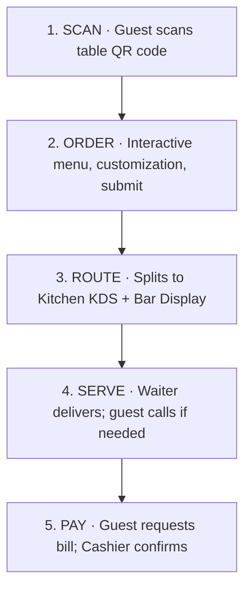

MesobOrdering connects every part of your venue — guest, kitchen, bar, waiter, and cashier — into one integrated real-time flow. This page walks through exactly what happens from the moment a guest sits down to the moment their table is cleared.

## The 5-Step Flow

## Step 1 — Scan (Instant Entrance)

Every table gets a **uniquely generated QR code**. When a guest scans it with their phone camera:

- The menu opens **instantly in their mobile browser**.
- **No app download** is required.
- The digital session is automatically tied to their specific table — no manual selection.
- The menu loads even on entry-level phones and 3G connections.

The experience feels like magic to the guest and requires zero training from your staff.

## Step 2 — Order (Interactive Customization)

The guest sees a beautifully designed, localized menu with:

- Categories, images, descriptions, and prices.
- Item-level customization ("no onions", "extra spicy", "medium rare").
- Special instructions per item.
- A cart they can review and edit before submitting.

They place the order with a single tap. No waiter had to walk to the table. No paper had to be printed.

## Step 3 — Route (Automatic Kitchen & Bar Dispatch)

This is where MesobOrdering does the hardest work — invisibly.

The moment the guest submits, the system **splits the order by department**:

- **Food items** appear on the [Kitchen Display System](/kitchen-view) in real time.
- **Beverages** appear on the [Bar Display](/staff/bar/display) simultaneously.
- Waiters see the whole order on their [Orders page](/staff/waiter/orders).

Updates are pushed via **WebSocket connections** — the order appears on screen within **0.2 seconds** of submission. No refresh required. No manual handoff. No paper.

## Step 4 — Serve (Waiter Optimization)

Waiters use the [Waiter Dashboard](/staff/waiter/dashboard) to stay on top of the floor:

- **Active table sessions** with running time and total value.
- **Live audio alerts** when a guest presses the "Call Waiter" button on their phone.
- **Overdue bill alerts** for tables that have been waiting too long to pay.
- **Order status board** — pending, preparing, ready, served.

Instead of writing tickets, waiters simply **deliver and confirm**. Their time is freed up for hospitality, not paperwork.

Waiters can also [place orders on behalf of a guest](/staff/waiter/place-order) when needed — for phone-in orders, elderly guests, or VIP tables.

## Step 5 — Pay (Seamless Checkout)

When the guest is ready:

1. They **request the bill** directly from their phone.
2. The [Cashier Portal](/staff/cashier/bills) instantly generates an itemized, tax-calculated receipt.
3. The guest sees **payment details on their screen** — the venue's TeleBirr phone number, CBE account name, or the option to pay cash to the cashier.
4. Once payment is received, the cashier taps **Confirm**, and the table is cleared for the next guest.

Every payment method is supported:

- **TeleBirr**
- **CBE Birr**
- Cash
- Loyalty redemption (applied at the bill)

## Behind the Scenes

While all five steps happen in the foreground, several systems run silently in the background to make it possible.

<CardGroup cols={2}>
  <Card title="Real-Time WebSocket Sync" icon="bolt">
    Orders, status changes, and call alerts propagate to every screen within 0.2 seconds. No polling. No delay.
  </Card>

  <Card title="Audit Log" icon="clipboard-list">
    Every status change, cancellation, and payment is recorded with the staff email, timestamp, and role for full [Fraud Control](/fraud-control).
  </Card>

  <Card title="Dynamic Pricing Rules" icon="tag">
    Prices are computed at order time based on your active [Dynamic Pricing](/dynamic-pricing) rules — Happy Hour discounts, peak-hour markups.
  </Card>

  <Card title="Loyalty Tracking" icon="star">
    Every qualifying visit is stamped automatically. Guests earn rewards without waiters keeping paper cards.
  </Card>
</CardGroup>

## What This Means for Your Venue

- **Faster table rollover** — no waiting for a waiter to arrive with a menu, take an order, or bring a bill.
- **Fewer errors** — orders go directly from guest to kitchen without a manual transcription step.
- **Happier staff** — waiters spend their time on hospitality, not on paperwork.
- **Full owner visibility** — every touchpoint is auditable end-to-end.

<Card title="See it live in minutes" icon="play" horizontal href="/quickstart">
  Set up your hotel, print your QR codes, and take your first live order today.
</Card>