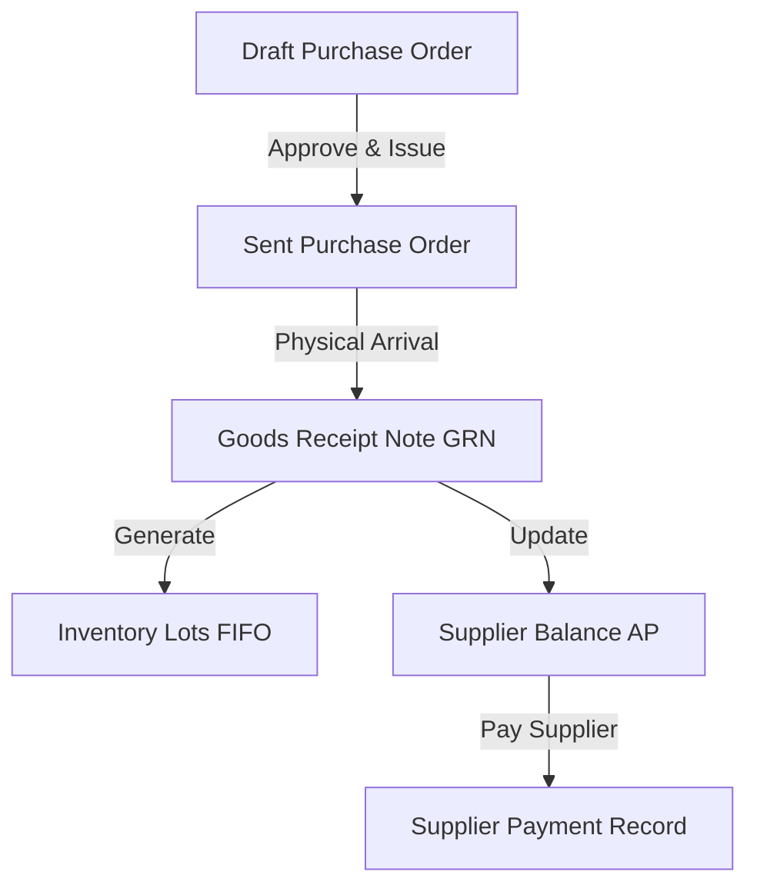

Procurement governs stock acquisition from external suppliers, lot allocation, and financial accounts payable tracking.

## 1. Purchase Orders (PO)

1. Navigate to **Inventory** → **Procurement** → **Purchase Orders** → Click `+ Create PO`.
2. Select **Supplier** (e.g. "Addis Spice PLC") and expected delivery date.
3. Add item lines, quantities in Packaging or Base Units, and agreed unit cost in ETB.
4. Click `Save Draft` or `Approve & Issue PO`.

---

## 2. Goods Receipt Notes (GRN) & FIFO Lots

When physical shipments arrive at the Central Store, the storekeeper records a Goods Receipt Note (GRN).

### Receiving Workflow:
1. Open **Inventory** → **Goods Receipts (GRN)** → Click `+ New GRN`.
2. Select **Supplier** and optional **PO Reference**.
3. Select Destination **Storage Location** (e.g. `Central Store`).
4. For each item received:
   - Input quantity received (e.g. `10 Crates` or `500 kg`).
   - Enter **Actual Unit Purchase Price (ETB)**.
   - Input **Lot Expiry Date** (if applicable).
5. Click **Post GRN**.

### System Actions on GRN Post:
- Automatically converts packaging units to base units.
- Generates a unique **`InventoryLot`** (e.g. `LOT-20260921-001`) storing exact remaining quantity, cost price, and timestamps.
- Appends a `GRN_RECEIPT` record to `StockMovement`.
- Increases supplier's `outstandingBalanceEtb` for Accounts Payable tracking.

---

## 3. Supplier Payments & Accounts Payable

Track supplier balances and record invoice payments:

1. Open **Inventory** → **Supplier Payments** → Click `+ Record Payment`.
2. Select **Supplier** and linked **GRN Reference**.
3. Input **Amount Paid (ETB)**, payment method (Cash, Bank Transfer, Check), and reference number.
4. Click `Save Payment`.
5. System updates GRN payment status (`UNPAID` → `PARTIALLY_PAID` → `PAID`).

<Tip>
  Supplier credit limits and outstanding balances can be monitored in real time under **Supplier Performance & AP Summary** analytics.
</Tip>
