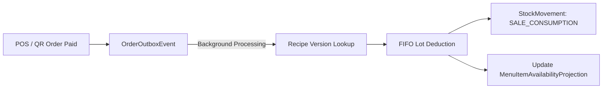

Connect digital POS menu items to inventory ingredient lots for automatic stock consumption and real-time availability forecasting.

## 1. Recipe Definition & Versioning

Map menu items to raw or prepared inventory ingredients.

1. Navigate to **Inventory** → **Recipes** → Click `+ Create Recipe`.
2. Select target **Menu Item** (e.g. "Special Kitfo").
3. Add Ingredients and required quantities per serving:
   - *Kitfo Prepared Meat:* `0.25 kg`
   - *Niter Kibbeh:* `0.05 kg`
   - *Mitmita Spice:* `0.01 kg`
4. Click **Save Recipe**.

<Note>
  Editing recipe ingredients automatically archives the old version and deploys a new `RecipeVersion` to maintain historical COGS audit accuracy.
</Note>

---

## 2. Asynchronous Outbox Auto-Deduction Engine

To ensure sub-second cashier checkout:
- POS order completion enqueues an `ORDER_CONFIRMED` event into `OrderOutboxEvent`.
- The background outbox processor executes `OrderInventoryProcess`:
  1. Resolves active recipe versions for ordered menu items.
  2. Allocates inventory from the terminal's configured storage location using FIFO.
  3. Records `SALE_CONSUMPTION` stock movements.
  4. Calculates real Cost of Goods Sold (COGS) and updates total profit margins.

---

## 3. Real-Time Servings Availability Projection

The projection engine calculates how many portions of a menu item can be served based on current ingredient stocks across storage locations:

$$\text{Max Servings} = \min \left( \frac{\text{Available Stock}_1}{\text{Recipe Quantity}_1}, \frac{\text{Available Stock}_2}{\text{Recipe Quantity}_2}, \dots \right)$$

- If Kitfo Meat stock = `5.0 kg` (recipe needs `0.25 kg`), max servings = `20`.
- If Mitmita spice stock drops to `0.05 kg` (recipe needs `0.01 kg`), max servings = `5`.
- Projections update automatically in `MenuItemAvailabilityProjection`.
- If `autoManageAvailability` is enabled on the MenuItem, items automatically toggle to **SOLD OUT** on waiter/guest menus when projection hits `0`.
